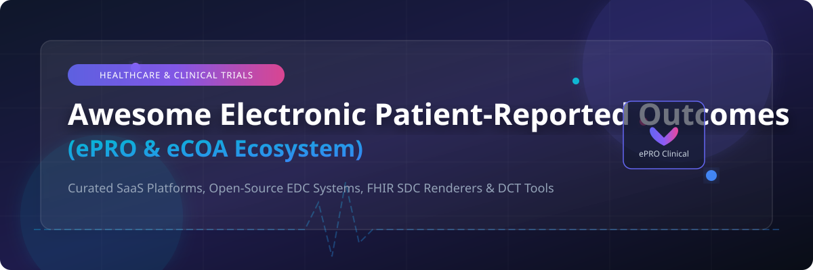

<p center>
<a href="https://github.com/ishandutta2007/Awesome-Awesome-Awesome"></a><a href="https://discord.gg/jc4xtF58Ve"></a> <a href="https://github.com/ishandutta2007/Awesome-Electronic-Patient-Reported-Outcomes/stargazers"></a> <a href="https://github.com/ishandutta2007/Awesome-Electronic-Patient-Reported-Outcomes/blob/main/LICENSE"></a> <a href="https://github.com/ishandutta2007/Awesome-Electronic-Patient-Reported-Outcomes/pulls"></a> <a href="https://github.com/ishandutta2007"></a>
</p>

# 🏥 Awesome Electronic Patient-Reported Outcomes (ePRO)

> A curated collection of top-tier **Electronic Patient-Reported Outcomes (ePRO)** SaaS platforms, **electronic Clinical Outcome Assessment (eCOA)** solutions, and **Open-Source GitHub Projects** for Decentralized Clinical Trials (DCT), Remote Patient Monitoring (RPM), and Real-World Evidence (RWE).

---

## 📌 Executive Overview & Ecosystem Focus

**Electronic Patient-Reported Outcomes (ePRO)** enable patients to directly report symptoms, functional status, treatment adherence, and health-related quality of life (HRQoL) using digital devices (smartphones, tablets, web applications). 

This repository serves as a comprehensive developer and clinical researcher directory tracking:
* 🏢 **Enterprise SaaS & Hosted eCOA Platforms** for commercial clinical trials and CRO deployments.
* 🔓 **Open-Source Electronic Data Capture (EDC) Systems** and FHIR-based Questionnaire renderers.
* 📜 **Consent & Security Frameworks** supporting 21 CFR Part 11, HIPAA, and GDPR compliance.

---

## 📚 Table of Contents

- [🏢 SaaS & Hosted Platforms](#-saas--hosted-platforms)
- [🔓 Open-Source GitHub Projects](#-open-source-github-projects)
- [🛠️ Architectural Blueprints for Custom ePRO Systems](#️-architectural-blueprints-for-custom-epro-systems)
- [🤝 How to Contribute](#-how-to-contribute)
- [⚖️ Legal & Regulatory Disclaimer](#️-legal--regulatory-disclaimer)
- [📈 Star History](#-star-history)
- [🤝 Support & Community](#-support--community)

---

## 🏢 SaaS & Hosted Platforms

📊 **Market Overview & Industry Dynamics**: The global Electronic Patient-Reported Outcomes (ePRO) & Electronic Clinical Outcome Assessment (eCOA) market size is estimated at **$2.1 Billion (2024–2025)** and projected to reach **$4.8 Billion by 2030** at a CAGR of ~14.5%. The market is **moderately fragmented** with accelerating consolidation among enterprise eClinical suites (IQVIA, Medidata, Veeva, Clario) alongside specialized niche platforms.

| 🏢 Platform | 📝 Description | 📊 Company Size / Valuation / Revenue | 💰 Pricing (Starting Tier) | 🎁 Free Tier / Free Trial Limits |
| :--- | :--- | :--- | :--- | :--- |
| **[Oracle ePRO](https://www.oracle.com/)** | Integrated ePRO module within Oracle Health Sciences & Clinical One platform for multi-site global clinical trials. | ~$53.0 Billion Revenue | Starting at $20,000 / year | 30-Day Free Trial (OCI Cloud Developer Sandbox) |
| **[IQVIA eCOA](https://www.iqvia.com/)** | Comprehensive eCOA, ePRO, and eConsent platform seamlessly integrated with IQVIA Connected Intelligence ecosystem. | ~$15.4 Billion Revenue | Starting at $50,000 / study | 30-Day Enterprise Demo Sandbox (1 active trial environment) |
| **[Medidata Patient Cloud](https://www.medidata.com/)** | Patient-centric digital health suite providing ePRO, eCOA, and eConsent with deep Medidata Rave EDC integration. | ~$6.0 Billion Parent Revenue (~$1B Medidata ARR) | Starting at $25,000 / study | 30-Day Developer Sandbox Access (1 demo protocol) |
| **[Veeva ePRO](https://www.veeva.com/)** | Life sciences ePRO solution fully integrated with Veeva Vault CDMS for end-to-end clinical operations. | ~$2.4 Billion Revenue (~$30B Valuation) | Starting at $30,000 / year | 14-Day Sandbox Demo Trial (max 3 study designs) |
| **[Medable](https://www.medable.com/)** | Decentralized trial platform offering ePRO, eCOA, eConsent, and BYOD remote patient monitoring. | ~$2.1 Billion Valuation (~$100M ARR) | Starting at $12,000 / study | 14-Day Guided Sandbox Trial (1 study protocol, 5 user accounts) |
| **[Clario](https://clario.com/)** | Clinical endpoint technology combining ERT and Bioclinica for eCOA, ePRO, cardiac safety, and imaging endpoints. | ~$1.1 Billion Revenue | Starting at $20,000 / study | 14-Day Sandbox Trial (1 study design, max 10 test users) |
| **[Signant Health](https://www.signanthealth.com/)** | Specializes in eCOA, ePRO, and eConsent with deep expertise in neuroscience, oncology, and chronic pain trials. | ~$400 Million Revenue | Starting at $15,000 / study | 14-Day Sandbox Trial (1 protocol, max 5 test users) |
| **[THREAD Science](https://www.threadresearch.com/)** | Decentralized clinical trial platform providing virtual visits, ePRO, and remote symptom logging. | ~$250 Million Valuation (~$50M ARR) | Starting at $10,000 / study | 14-Day Trial Demo Access (1 study workspace) |
| **[Clinical Ink](https://www.clinicalink.com/)** | Direct eSource and ePRO platform capturing patient outcome data during in-clinic and remote study visits. | ~$80 Million ARR | Starting at $15,000 / study | 14-Day Demo Sandbox (1 visit workflow, 5 participants) |
| **[YPrime](https://www.yprime.com/)** | Flexible eClinical platform combining eCOA, ePRO, IRT, and clinical trial data management tools. | ~$60 Million ARR | Starting at $12,000 / study | 14-Day Trial Sandbox (1 active site configuration) |
| **[eClinical Solutions](https://www.eclinicalsol.com/)** | Data management platform featuring elluminate data science tools supporting ePRO and eCOA integration. | ~$50 Million ARR | Starting at $15,000 / year | 14-Day Sandbox Demo (elluminate platform trial, 5 users) |
| **[Castor ePRO](https://www.castoredc.com/)** | Modular ePRO feature integrated within Castor EDC for rapid patient survey collection and study management. | ~$30 Million Funding (~$15M ARR) | Starting at $1,200 / year ($100/mo) | 14-Day Full Feature Free Trial (1 active study, unlimited ePRO forms) |
| **[Kayentis](https://www.kayentis.com/)** | Specialized eCOA/ePRO vendor focusing on digital therapeutics, ophthalmology, and respiratory clinical trials. | ~$25 Million ARR | Starting at $10,000 / study | 14-Day Sandbox Trial (1 study template) |
| **[CRScube](https://www.crscube.io/)** | All-in-one eClinical solution featuring cubePRO, cubeCDMS (EDC), and cubeIWRS for unified data management. | ~$15 Million ARR | Starting at $1,000 / month | 14-Day Free Sandbox Trial (cubePRO trial environment) |
| **[TrialKit](https://www.trialkit.com/)** | Cloud and mobile clinical research suite offering configurable ePRO, eCOA, EDC, and eConsent modules. | ~$10 Million ARR | Starting at $500 / month | 14-Day Free Trial (1 study, up to 25 test participants) |
| **[ClinOne](https://clinone.com/)** | Patient engagement platform providing eConsent, ePRO, and remote study visit tracking for clinical trials. | ~$8 Million ARR | Starting at $800 / month | 14-Day Free Sandbox Access (1 trial site, 10 participants) |

---

## 🔓 Open-Source GitHub Projects

Below is a list of mature open-source projects, frameworks, FHIR SDC form renderers, and EDC platforms suitable for constructing self-hosted ePRO data collection systems.

> **Sorted by GitHub_Stars (Descending)**

* 🌟 **[Fasten Health](https://github.com/fastenhealth/fasten-onprem)** <a href="https://github.com/fastenhealth/fasten-onprem/stargazers"></a>  
  An open-source, self-hosted personal health record and patient portal system. Connects directly to electronic health record (EHR) systems via SMART on FHIR to pull patient records, medical history, and self-reported outcomes into a unified dashboard. **Go/Vue.js | MIT License**.

* 🌟 **[Medplum](https://github.com/medplum/medplum)** <a href="https://github.com/medplum/medplum/stargazers"></a>  
  Headless open-source EHR and healthcare platform supporting FHIR Questionnaire and QuestionnaireResponse resources out of the box. Ideal for building custom developer-first ePRO applications, patient portals, and automated clinical workflows. **TypeScript/React | Apache 2.0 License**.

* 🌟 **[HAPI FHIR](https://github.com/hapifhir/hapi-fhir)** <a href="https://github.com/hapifhir/hapi-fhir/stargazers"></a>  
  Complete open-source implementation of the HL7 FHIR specification in Java. Serves as the core backend FHIR repository for storing, querying, and managing structured QuestionnaireResponse data collected from ePRO devices. **Java | Apache 2.0 License**.

* 🌟 **[Form.io JavaScript SDK](https://github.com/formio/formio.js)** <a href="https://github.com/formio/formio.js/stargazers"></a>  
  Flexible JSON-powered form builder and rendering engine used widely in healthcare and clinical research to construct complex conditional forms, survey logic, and ePRO patient questionnaires. **JavaScript | MIT License**.

* 🌟 **[Google FHIR](https://github.com/google/fhir)** <a href="https://github.com/google/fhir/stargazers"></a>  
  Google's set of libraries for working with FHIR data in C++, Java, and Python. Includes protocol buffer representations of FHIR resources and utilities for processing clinical questionnaires and ePRO survey responses. **C++/Java/Python | Apache 2.0 License**.

* 🌟 **[ODK Collect](https://github.com/getodk/collect)** <a href="https://github.com/getodk/collect/stargazers"></a>  
  Android data collection app used worldwide for offline field research, health worker surveys, and mobile ePRO data logging. Supports complex logic, media attachments, and OpenRosa XForms standards. **Java/Kotlin | Apache 2.0 License**.

* 🌟 **[OpenClinica](https://github.com/OpenClinica/OpenClinica)** <a href="https://github.com/OpenClinica/OpenClinica/stargazers"></a>  
  Pioneering commercial open-source platform for Electronic Data Capture (EDC) and Clinical Data Management (CDM). Features web-based eCRF builder, audit trails, electronic signatures, visit scheduling, and ePRO trial management modules. **Java | LGPL License**.

* 🌟 **[LibreClinica](https://github.com/reliatec-gmbh/LibreClinica)** <a href="https://github.com/reliatec-gmbh/LibreClinica/stargazers"></a>  
  Community-maintained fork and successor to OpenClinica. Fully GCP-compliant EDC platform providing complex field validations, SDV workflows, CDISC ODM-XML exports, and OpenRosa API backend for **integration with ODK mobile ePRO tools**. **Java | LGPL 3.0 License**.

* 🌟 **[smart-forms](https://github.com/aehrc/smart-forms)** <a href="https://github.com/aehrc/smart-forms/stargazers"></a>  
  React-based FHIR Structured Data Capture (SDC) form application developed by CSIRO Australian e-Health Research Centre. Renders complex HL7 FHIR Questionnaires for clinical assessments and patient self-reporting. **TypeScript/React | Apache 2.0 License**.

* 🌟 **[lforms-fhir-app](https://github.com/LHNCBC/lforms-fhir-app)** <a href="https://github.com/LHNCBC/lforms-fhir-app/stargazers"></a>  
  SMART on FHIR app powered by LHC-Forms widget for rendering FHIR SDC Questionnaire resources and generating compliant QuestionnaireResponse data objects inside EHR and ePRO portals. **JavaScript | Open Source**.

* 🌟 **[clinicedc / edc](https://github.com/clinicedc/edc)** <a href="https://github.com/clinicedc/edc/stargazers"></a>  
  Modular Django framework for longitudinal multi-site clinical trial data capture. Handles informed consent, scheduled visits, adverse event tracking, data export, and clinical outcome scoring. **Python/Django | GPL 3.0 License**.

* 🌟 **[Arcwell](https://github.com/arcweb/arcwell)** <a href="https://github.com/arcweb/arcwell/stargazers"></a>  
  Open-source clinical research platform by Arcweb Technologies. Features a flexible rules engine for digital health programs, executing 4,000+ custom rules for clinical decision support and patient outcome logging. **TypeScript/Node.js | Apache 2.0 License**.

* 🌟 **[REDCapPRO](https://github.com/AndrewPoppe/REDCap-PRO)** <a href="https://github.com/AndrewPoppe/REDCap-PRO/stargazers"></a>  
  External REDCap module facilitating regulatory-compliant patient self-registration, MFA login, automated questionnaire dispatch, and isolated patient credential management for clinical research studies. **PHP | GPL 3.0 License**.

---

## 🛠️ Architectural Blueprints for Custom ePRO Systems

For research institutions and digital health teams constructing custom ePRO infrastructure:

```
+-----------------------------------------------------------------------------------+
|                              PATIENT FRONTEND LAYER                               |
|   +-----------------------+     +-------------------+     +-------------------+   |
|   |  smart-forms (React)  |  OR | lforms-fhir-app   |  OR | ODK Collect (App) |   |
|   +-----------------------+     +-------------------+     +-------------------+   |
+------------------------------------------+----------------------------------------+
                                           | FHIR SDC / REST API
                                           v
+-----------------------------------------------------------------------------------+
|                             CORE EDC / FHIR BACKEND                               |
|   +-----------------------+     +-------------------+     +-------------------+   |
|   |  Medplum (Headless)   |  OR |  LibreClinica EDC |  OR | HAPI FHIR Server  |   |
|   +-----------------------+     +-------------------+     +-------------------+   |
+------------------------------------------+----------------------------------------+
                                           |
                                           v
+-----------------------------------------------------------------------------------+
|                        SECURITY & REGULATORY COMPLIANCE                           |
|   +-----------------------+     +-------------------+     +-------------------+   |
|   | PrivacyLens (Consent) |  &  | REDCapPRO (Auth)  |  &  | PostgreSQL (Enc)  |   |
|   +-----------------------+     +-------------------+     +-------------------+   |
+-----------------------------------------------------------------------------------+
```

---

## 🤝 How to Contribute

1. Fork this repository.
2. Update or add new entries to `README.md` maintaining table formats and badge links.
3. Provide link, company size/valuation, pricing tier, and free trial details.
4. Open a Pull Request with a short summary of changes.

---

## ⚖️ Legal & Regulatory Disclaimer

- This list is **community-curated** for educational and architectural reference only; inclusion does not constitute endorsement.
- Clinical trials involving patient data collection must strictly comply with applicable regulatory frameworks including **21 CFR Part 11**, **GCP (ICH E6)**, **HIPAA**, and **GDPR**.

---

## 📈 Star History

[](https://star-history.dera.page/#ishandutta2007/Awesome-Electronic-Patient-Reported-Outcomes&type=date&legend=top-left)

---

## 🤝 Support & Community

Thank you for exploring **Awesome Electronic Patient-Reported Outcomes (ePRO)**! 

If you find this repository valuable for your clinical research, healthcare product development, or trial data engineering work, please consider supporting the project:

* ⭐ **Star this repository** to help others discover it.
* 🔀 **Fork & Contribute** by adding new ePRO, eCOA, or FHIR-based open-source projects via Pull Requests.
* 📢 **Share** with colleagues, clinical trial coordinators, and digital health developers.
* ☕ **Sponsor / Buy me a coffee**: Support ongoing maintenance on the [GitHub Sponsors Dashboard](https://github.com/sponsors/ishandutta2007).
